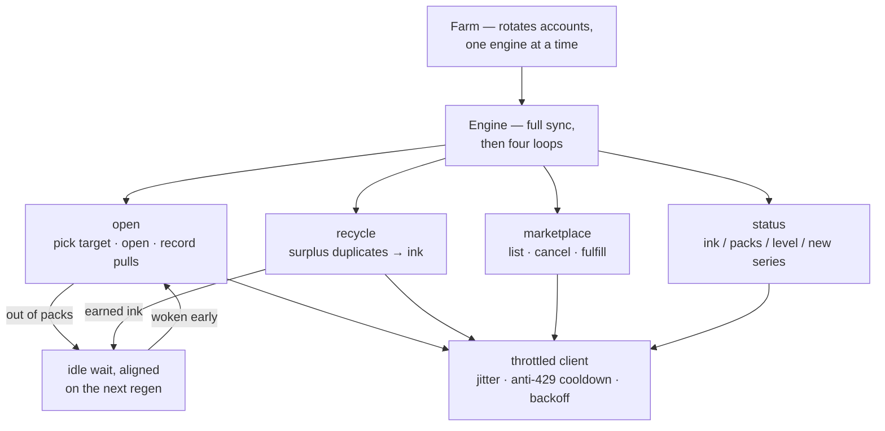

<div align="center">

# 🃏 wikitcg-completer

### Complete your [wikitcg.net](https://wikitcg.net) collection on autopilot.

A self-hosted dashboard that opens packs, recycles duplicates into ink, trades on the marketplace
and farms several accounts in turn — while showing you every move it makes, live.

[](https://www.python.org/)
[](https://fastapi.tiangolo.com/)
[](#-tests)
[](LICENSE)

</div>

> [!WARNING]
> **Unofficial project, not affiliated with wikitcg.net.** Automating a website may breach its terms of
> service and can get your account limited or banned. Use it on accounts you are willing to lose.
> The throttling is deliberately polite — please don't tune it into a hammer.

---

## ✨ What it does

- **Opens the right packs.** Targets the incomplete series missing the most cards, detects new series as they launch, and once everything is complete keeps farming whichever series pays the most ink per pull — measured from your own pull history.
- **Turns duplicates into ink.** Recycles surplus copies while keeping one to collect plus a per-rarity reserve. Cards the server won't recycle get a persisted cooldown instead of an infinite retry, and the daily quota pauses recycling without ever stopping pack opening.
- **Buys its own restocks.** Optional: when free packs run dry it spends ink on a refill — recycling first if the balance is short, and never touching the ink reserve you set.
- **Trades on the marketplace.** Opt-in. Lists spare duplicates against the cards you're missing using the site's give-to-get rarity rules, cancels listings the moment the card drops from a pack or the offer goes stale, and fulfills other players' listings when the swap helps you.
- **Farms multiple accounts.** One engine at a time, rotating automatically when an account runs dry. Each account keeps its own collection database, its own pinned series and its own cookie in the OS keyring.
- **Handles the boring failures.** Jittered read/action throttles, an anti-429 cooldown every few heavy actions, `Retry-After`-aware exponential backoff, and a clean stop with a visible banner when your session expires.
- **Shows you everything.** A live WebSocket feed, completion and rarity breakdowns, ink history sparklines, and the exact list of cards you still need.

## 🚀 Quick start

**You'll need** Python 3.11+, a wikitcg.net account, and an OS keyring (Windows Credential Manager, macOS Keychain, or Secret Service on Linux).

```bash
git clone https://github.com/dochreidte/wikitcg-completer.git
cd wikitcg-completer

python -m venv venv
source venv/bin/activate      # Windows: venv\Scripts\activate
pip install -r requirements.txt

python run.py
```

Open **http://127.0.0.1:8765**. There's nothing to configure on disk — the app ships with working
defaults and saves whatever you change in the dashboard.

## 🔑 Connect your account

1. **Add an account** — *Accounts → Add an account*. Name it, and optionally pin it to one series (leave empty to let the engine choose).
2. **Paste your session cookie** — click the *session* chip in the header. Log in to wikitcg.net, open your browser's developer tools, and copy the value of the **`wtcg_session`** cookie (*Application → Storage → Cookies* in Chrome/Edge, *Storage → Cookies* in Firefox). The dashboard decodes and displays the account and expiry it finds, so you can confirm it's the right one.
3. **Press Start.** The engine syncs your collection, then gets to work.

When the site rotates your cookie the app stores the fresh one automatically, so a running session keeps
itself alive. When it finally expires you get a banner — paste a new one and start again.

## 🎛 The dashboard

| View | What's there |
| :--- | :--- |
| **Overview** | Run controls · ink / packs / level / completion tiles with sparklines · series closest to done · live feed |
| **Collection** | Per-series progress, rarity breakdown, and the exact cards you're still missing |
| **Accounts** | Add, rename, re-pin, switch and delete accounts · per-account stats · keyring and token status |
| **Market** | Your active listings, the open market, and the marketplace toggles |
| **Settings** | Opening, recycling and diagnostics options |
| **Log** | The rolling event log |

## ⚙️ Settings

| Setting | Default | Effect |
| :--- | :--- | :--- |
| `autostart` | off | Start farming as soon as the server boots |
| `auto_recycle` | on | Recycle surplus duplicates automatically |
| `recycle_mode` | `surplus` | `surplus` recycles on a timer · `on_demand` only when ink is needed for a restock |
| `recycle_reserve_mode` | `fixed` | `fixed` keeps a set number of spares per rarity · `missing` keeps as many spares as you have missing cards in that rarity |
| `recycle_priority` | `common_first` | `common_first` preserves trade material · `rare_first` maximises ink within the daily quota |
| `buy_packs_with_ink` | off | Spend ink on a restock when free packs run out |
| `min_ink_reserve` | `0` | Ink to never spend |
| `mystery_pack` | on | Open the mystery pack whenever it's available (~every 6h) |
| `marketplace.enabled` | off | Master switch for all marketplace activity |
| `max_listings` | `5` | Cap on your simultaneous active listings |
| `fulfill_others` | off | Fulfill other players' listings when the trade helps you |
| `near_completion_max_missing` | `0` | Only list for series within this many cards of complete (`0` = any) |

<details>
<summary><b>Advanced tuning</b></summary>

<br>

Throttle intervals, retry policy, per-rarity `keep_spares`, recycle values, loop cadences, and the
server host and port all live in the `_DEFAULTS` dictionary at the top of
[`app/config.py`](app/config.py). Edit it there and restart.

The defaults are chosen to look like a human browsing: ~0.4 s between reads, ~2 s between actions,
both jittered, plus a 25 s cooldown every 8 pack opens. Lowering these raises your odds of a
rate-limit — or a ban.

</details>

## 🧠 How it works

The **farm** owns the account rotation and runs one **engine** at a time. Each engine runs four
cooperative loops over a single throttled HTTP client:



Opening always wins the throttle, so a run of one-by-one recycle calls can't starve it. The idle wait
lines itself up with your next pack regeneration and is interruptible — earning enough ink for a
restock wakes the opener immediately instead of sitting out the timer.

## 🔒 Security

- **Cookies live in the OS keyring**, never in the repo and never in a config file. No keyring? The dashboard warns you, and you can pass cookies as `WIKITCG_SESSION_<ACCOUNT_ID>` environment variables instead.
- **The dashboard is localhost-only.** Middleware rejects any request whose `Host` isn't a loopback name, and any state-changing request with a cross-site `Origin` — blocking both CSRF from a stray web page and DNS-rebinding attacks on the local port.
- **Nothing leaves your machine** except the calls made to wikitcg.net on your behalf. No telemetry, no cloud. (The UI does load its webfonts from Google Fonts; delete the `<link>` tags in `frontend/index.html` for a fully offline dashboard.)
- **Nothing sensitive is committed** — databases, logs and secrets are all gitignored.

## 📜 License

[GNU GPL v3](LICENSE) — free to use, study, share and modify; derivative works must stay
free under the same license.

<div align="center">
<br>
Issues and pull requests welcome.
</div>
